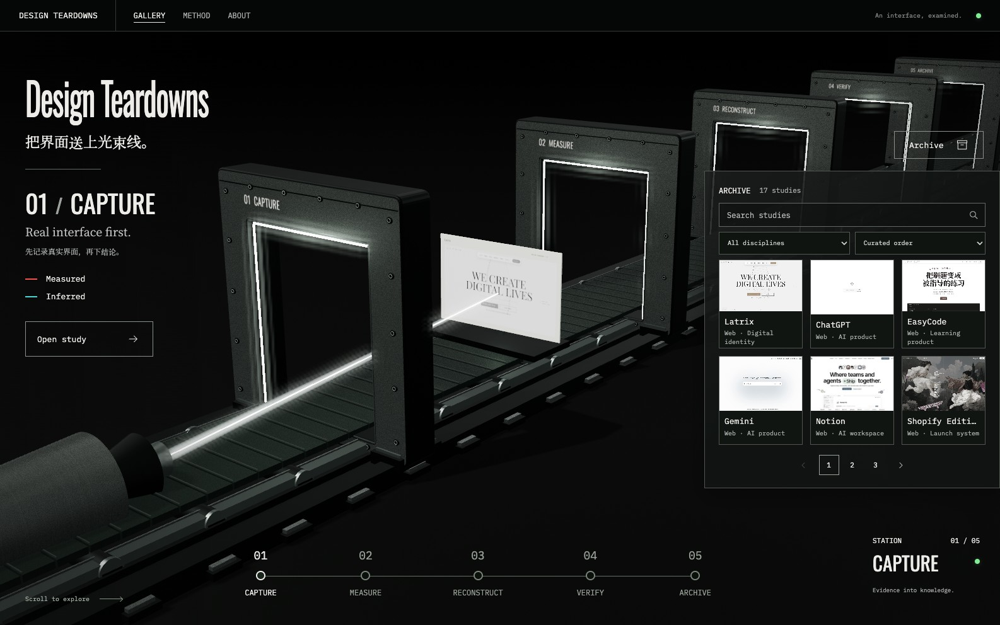

# Design Teardowns

把优秀界面拆成可验证、可复用的设计知识。



[浏览画廊](https://yunyueli.github.io/design-teardowns/teardowns/index.html) · [研究方法](skills/design-teardown/references/method.md) · [实现说明](DESIGN.md) · [授权与出处](NOTICE)

## 一个案例，五个阶段

**Capture → Measure → Reconstruct → Verify → Archive**

从真实页面开始，记录素材与状态，测量样式和动效，重建关键体验，再将结论与出处逐项对照。每份案例区分实测与推断，并保留证据边界。

画廊把这五个阶段做成一条可探索的光束线。滚动或点击阶段，传送带、滚轮和案例预览同步移动，相机跟随预览前进。滚动停止后保留当前位置，点击阶段才精确停靠；阶段文字在预览实际到站后切换。场景由本地 Three.js 实时渲染；金属、灯光、光束和预览拥有共同的空间与遮挡关系。它是研究过程的视觉表达，具体结论仍由各案例中的证据与分析完成。

案例档案库目前有 **20 份设计拆解**。首页展示六个精选案例，支持搜索、分类、排序和分页；打开 Case archive 可以继续浏览。案例增加时，五阶段流程和每页六项的布局保持不变。手机、横屏、键盘访问和减弱动态偏好均有对应路径；三维场景不可用时仍可通过静态入口进入案例页面。

## 当前展览

| 案例                                                                    | 研究对象                               |
| ----------------------------------------------------------------------- | -------------------------------------- |
| [Shopify Editions Winter ’26](teardowns/shopify-editions/teardown.html) | The Renaissance Edition 的发布系统     |
| [Moonshot AI](teardowns/moonshot/teardown.html)                         | 月之暗面的 AI 平台品牌页面             |
| [Comet](teardowns/comet/teardown.html)                                  | Perplexity 的 AI 浏览器                |
| [Latrix](teardowns/latrix/teardown.html)                                | AI Beings 品牌页面的古典排版与字母螺旋 |
| [ChatGPT](teardowns/chatgpt/teardown.html)                              | OpenAI overview 页面的留白与产品叙事   |
| [EasyCode](teardowns/easycode/teardown.html)                            | 编程练习、指导与反馈页面               |

完整目录见 [catalogue.js](teardowns/_gallery/catalogue.js)。点击案例进入对应设计拆解页，三维台车中的默认预览为 Latrix。

## 本地运行

在仓库根目录运行：

```bash
python3 -m http.server 4174 --bind 127.0.0.1
```

打开 [本地画廊](http://127.0.0.1:4174/teardowns/index.html)。画廊不需要安装 npm 依赖、构建或后端服务；运行时、字体和图像均随仓库提供。请通过 HTTP 预览，避免 `file://` 对图片纹理的限制。

## 维护案例档案库

先在 [catalogue.js](teardowns/_gallery/catalogue.js) 中添加经过出处核对的记录、案例页面和封面，再运行：

```bash
node tools/build-gallery-featured.mjs
node tools/build-gallery-featured.mjs --check
node tools/check-gallery.mjs
```

这两个工具只使用 Node.js 内置模块。生成器同步精选数据与数量；检查器核对数据一致性、案例入口、封面、文档和许可路径。精选六项的元数据从完整目录派生，默认顺序在加载完整目录、筛选后返回及展开弹窗时保持一致。旧的 `tools/generate_index.py` 兼容入口也只更新数据，不再覆盖首页布局。

## 研究产物

| 文件                                                            | 用途                           |
| --------------------------------------------------------------- | ------------------------------ |
| `teardown.html`                                                 | 可交互的研究页与复现示例       |
| `设计解构.md`                                                   | 视觉系统、布局与交互分析       |
| `复刻指南.md`                                                   | 实现步骤与工程取舍             |
| `出处与方法.md`                                                 | 捕获来源、测量方法、推断和局限 |
| `事实核查.md`、`设计评审.md`                                    | 逐项核对与研究复盘             |
| `tokens.json`、`design-tokens.css`、`real-assets/manifest.json` | 已采集的结构化证据与资产出处   |

具体产物以每份研究为准。可复用的捕获与研究流程位于 [design-teardown Skill](skills/design-teardown/SKILL.md)。通过 Claude Code 插件市场安装：

```text
/plugin marketplace add YunyueLi/design-teardowns
/plugin install design-teardown@design-teardowns
```

也可使用仓库中的 [design-teardown.skill](design-teardown.skill)。捕获工具的浏览器依赖与画廊运行依赖分开管理。

## 验证与交付

浏览器验收覆盖五阶段停靠、连续滚动、阶段切换、搜索分页、键盘、横竖屏及真实 WebGL 故障恢复；当前本地完整检查 **45/45 通过**（SwiftShader 下执行功能验收，GPU 时延门槛不作认证）。README 上图来自实际运行的页面。命令、实测数据和验证边界见 [验收记录](ACCEPTANCE.md)。发布前由 CI 重跑数据与浏览器检查，通过后部署到 GitHub Pages；线上版本以 [发布记录](https://github.com/YunyueLi/design-teardowns/actions/workflows/pages.yml) 为准。

## 授权

项目代码采用 [MIT](LICENSE-CODE)，项目有权许可的原创内容采用 [CC BY 4.0](LICENSE)。第三方商标、截图内容、字体、媒体和原站素材保留原权利人的权利；素材的研究用途与使用边界见 [NOTICE](NOTICE) 及各研究的出处文档。

Three.js 与内置字体的许可随仓库保存。本项目独立于所研究产品，无隶属、赞助或背书关系。
