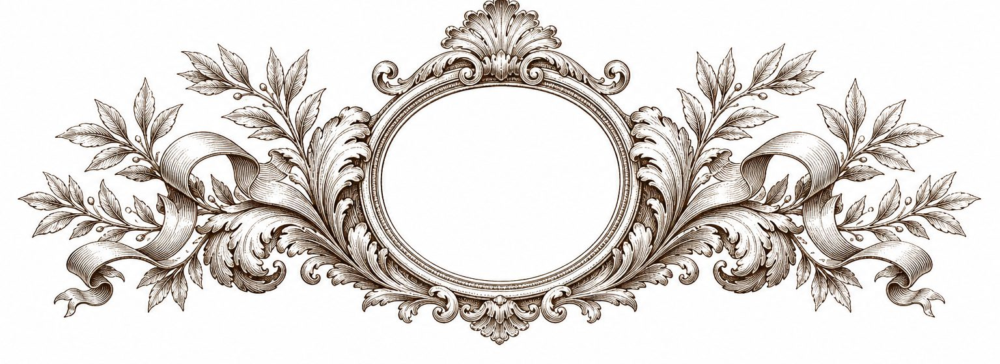
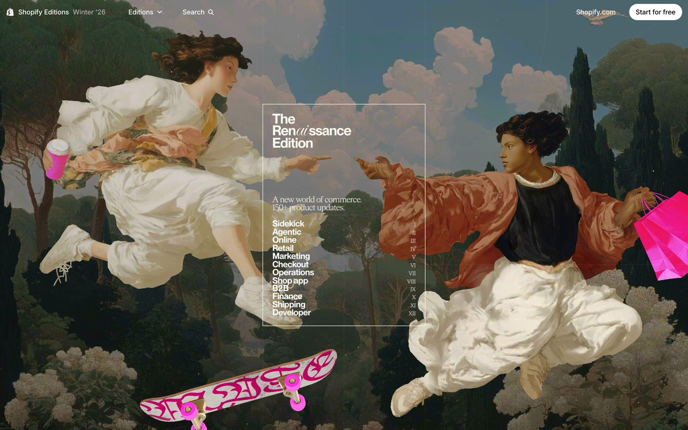
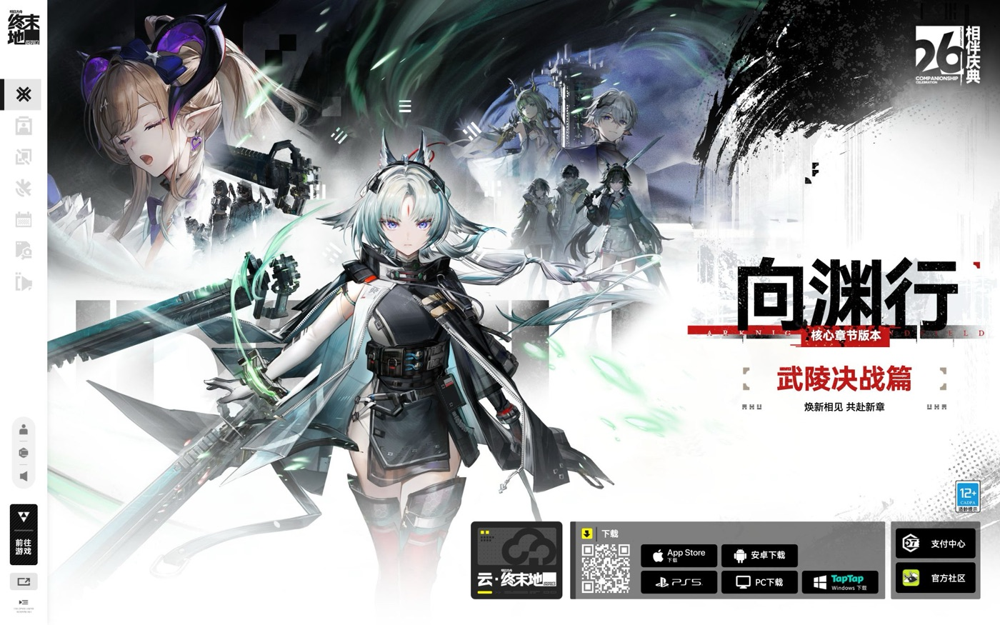
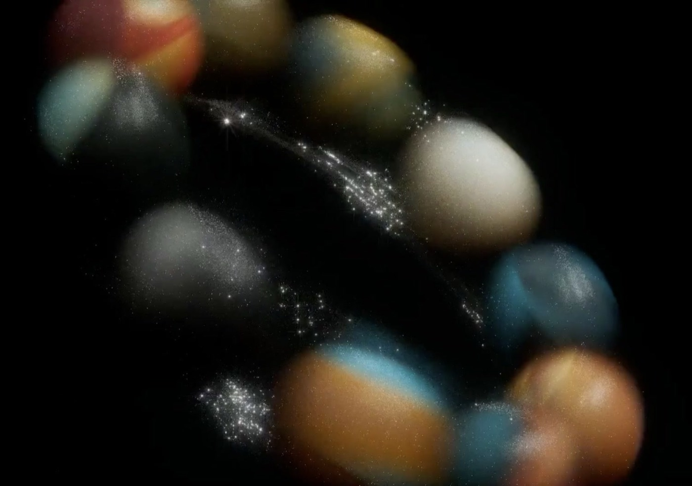
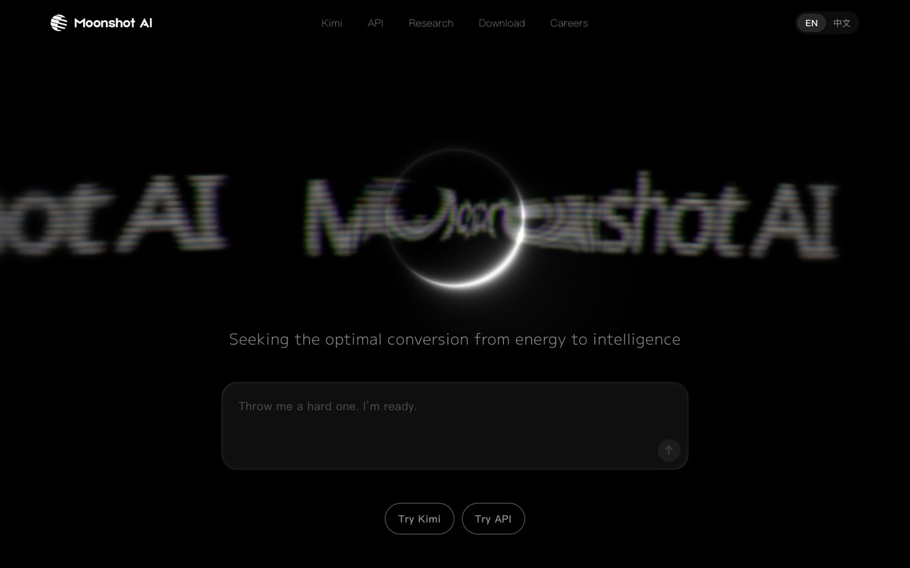
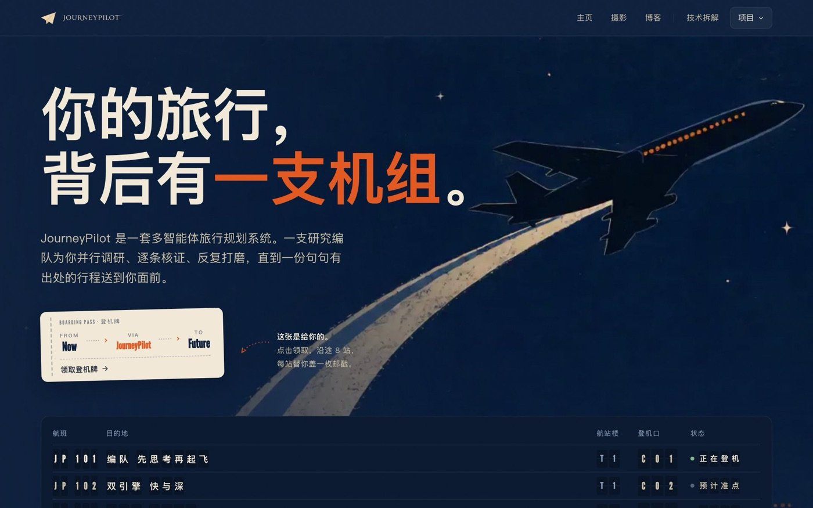
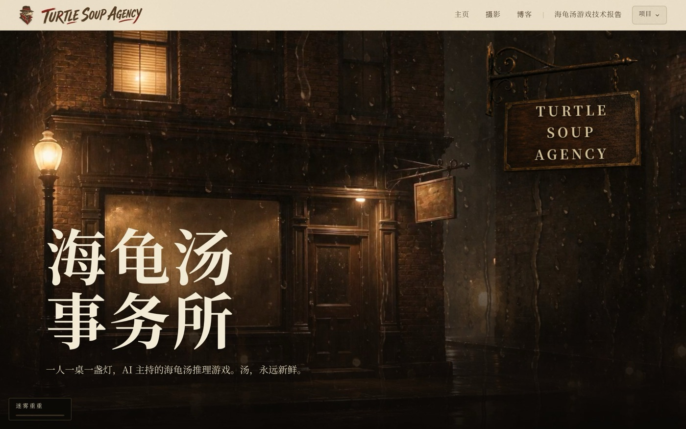

<div align="center">

<a href="https://yunyueli.github.io/design-teardowns/teardowns/index.html">

</a>

# 拆解画廊

### Design Teardowns

Seventeen studies of living pages, with every colour, every letterform<br/>and every easing curve measured from the work itself.

十七座顶级落地页的设计逆向。每一个颜色、每一个字号、每一条缓动曲线，都从原作里实际测量得来。

<br/>

<a href="https://yunyueli.github.io/design-teardowns/teardowns/index.html"></a>

[](LICENSE-CODE)
[](LICENSE)
[](skills/design-teardown)


</div>

<br/>

Every teardown here follows one rule: facts over vibes. A headless browser reads the live site's computed styles and design tokens, all assets and production source are archived, and the analysis is rebuilt in the subject's own visual language. Numbers are labeled measured or inferred, and each one can be traced back to its source.

每份拆解都守同一条规矩：不凭感觉，只认实测。无头浏览器读取线上站点真实的计算样式和设计 token，资产与生产源码全部存档，分析用被拆对象自己的视觉语言重建。数值分「实测」与「推断」两种口径，每一个都能回溯到出处。

## 馆内一瞥 A glimpse inside

<table>
<tr>
<td width="33%"><a href="https://yunyueli.github.io/design-teardowns/teardowns/shopify-editions/teardown.html"></a><p align="center"><sub><b>Shopify Editions Winter ’26</b><br/>Renaissance manuscript, Theatre.js, a two-window WebRTC easter egg</sub></p></td>
<td width="33%"><a href="https://yunyueli.github.io/design-teardowns/teardowns/endfield/teardown.html"></a><p align="center"><sub><b>Arknights: Endfield</b><br/>Industrial HUD with a 218,000-point WebGL2 particle theatre</sub></p></td>
<td width="33%"><a href="https://yunyueli.github.io/design-teardowns/teardowns/comet/teardown.html"></a><p align="center"><sub><b>Comet</b><br/>A native browser, unpacked from resources.pak and recorded frame by frame</sub></p></td>
</tr>
<tr>
<td width="33%"><a href="https://yunyueli.github.io/design-teardowns/teardowns/moonshot/teardown.html"></a><p align="center"><sub><b>Moonshot AI</b><br/>An eclipse halo on pure black, with RGB-glitched brand type</sub></p></td>
<td width="33%"><a href="https://yunyueli.github.io/design-teardowns/teardowns/journeypilot/teardown.html"></a><p align="center"><sub><b>JourneyPilot</b><br/>Retro-aviation cockpit dashboards in midnight blue</sub></p></td>
<td width="33%"><a href="https://yunyueli.github.io/design-teardowns/teardowns/turtle-soup/teardown.html"></a><p align="center"><sub><b>海龟汤事务所</b><br/>A rainy-night detective bureau with stamp-press physics</sub></p></td>
</tr>
</table>

<div align="center"><sub>更多展品在画廊里：<a href="https://yunyueli.github.io/design-teardowns/teardowns/index.html">yunyueli.github.io/design-teardowns</a></sub></div>

## 藏品总目 The catalogue

| Plate | 作品 | Signature | 进入 |
|:--|:--|:--|:--|
| I | **Shopify Editions Winter ’26** | Renaissance manuscript: construction lines, Theatre.js keyframes, a two-window WebRTC key easter egg | [Live](https://yunyueli.github.io/design-teardowns/teardowns/shopify-editions/teardown.html) / [档案](teardowns/shopify-editions/) |
| II | **明日方舟：终末地** Arknights: Endfield | Industrial HUD, a 218,000-point E.P.S particle theatre, luminance-keyed video FX | [Live](https://yunyueli.github.io/design-teardowns/teardowns/endfield/teardown.html) / [档案](teardowns/endfield/) |
| III | **Comet** | Native-app reverse engineering: resources.pak, source-level tokens, CDP frame capture | [Live](https://yunyueli.github.io/design-teardowns/teardowns/comet/teardown.html) / [档案](teardowns/comet/) |
| IV | **Linear** | Dark precision dashboard with an animated agent dot matrix | [Live](https://yunyueli.github.io/design-teardowns/teardowns/linear/teardown.html) / [档案](teardowns/linear/) |
| V | **Moonshot AI** | Pure black, an eclipse halo, RGB-glitched brand type | [Live](https://yunyueli.github.io/design-teardowns/teardowns/moonshot/teardown.html) / [档案](teardowns/moonshot/) |
| VI | **tutti** | Cinematic black stage framed by a macOS window | [Live](https://yunyueli.github.io/design-teardowns/teardowns/tutti/teardown.html) / [档案](teardowns/tutti/) |
| VII | **OJO** | Starry-night narrative with typewriter code and a skill marquee | [Live](https://yunyueli.github.io/design-teardowns/teardowns/ojo/teardown.html) / [档案](teardowns/ojo/) |
| VIII | **Converge AI** | Minimal black and white around one slowly converging orb | [Live](https://yunyueli.github.io/design-teardowns/teardowns/converge/teardown.html) / [档案](teardowns/converge/) |
| IX | **ChatGPT** | Restrained white, a sea of prompt cards on a watercolor base | [Live](https://yunyueli.github.io/design-teardowns/teardowns/chatgpt/teardown.html) / [档案](teardowns/chatgpt/) |
| X | **Notion** | Friendly white with highlight pills and hand-drawn avatars | [Live](https://yunyueli.github.io/design-teardowns/teardowns/notion/teardown.html) / [档案](teardowns/notion/) |
| XI | **Gemini** | Soft glow gradients around a rounded chat entry | [Live](https://yunyueli.github.io/design-teardowns/teardowns/gemini/teardown.html) / [档案](teardowns/gemini/) |
| XII | **Lovart** | Elegant serif type over a visualized agent canvas | [Live](https://yunyueli.github.io/design-teardowns/teardowns/lovart/teardown.html) / [档案](teardowns/lovart/) |
| XIII | **Latrix** | Off-white gallery wall with a twisting Playfair wordmark | [Live](https://yunyueli.github.io/design-teardowns/teardowns/latrix/teardown.html) / [档案](teardowns/latrix/) |
| XIV | **Lagom** | Paper viewfinder: travel photo annuals in quiet serif type | [Live](https://yunyueli.github.io/design-teardowns/teardowns/imlagom/teardown.html) / [档案](teardowns/imlagom/) |
| XV | **EasyCode** | White paper and red pen, a graded-homework motif across 16 screens | [Live](https://yunyueli.github.io/design-teardowns/teardowns/easycode/teardown.html) / [档案](teardowns/easycode/) |
| XVI | **JourneyPilot** | Retro-aviation cockpit dashboards across 11 screens | [Live](https://yunyueli.github.io/design-teardowns/teardowns/journeypilot/teardown.html) / [档案](teardowns/journeypilot/) |
| XVII | **海龟汤事务所** | Rainy-night detective bureau, stamp-press physics on case files | [Live](https://yunyueli.github.io/design-teardowns/teardowns/turtle-soup/teardown.html) / [档案](teardowns/turtle-soup/) |

每个档案文件夹里有：`teardown.html`（互动拆解页）、五份中文文档（设计解构、复刻指南、出处与方法、事实核查、设计评审）、`design-tokens.css` 与 `tokens.json`（实测 token）、逐屏截图，以及 `real-assets/`（研究用第三方素材存档）。

## 拆解技能 The skill

这套拆解由一个可复用的 Claude Agent Skill 完成：[`design-teardown`](skills/design-teardown)。对任何网址说一句自然语言（例如 "tear down the design of https://linear.app" 或「扒出某站的真实配色、字体、缓动」），它会跑完整条流水线。

**安装（Claude Code），三选一：**

插件市场，两行命令：
```
/plugin marketplace add YunyueLi/design-teardowns
/plugin install design-teardown@design-teardowns
```
或者把技能复制进技能目录：
```bash
git clone https://github.com/YunyueLi/design-teardowns
cp -r design-teardowns/skills/design-teardown ~/.claude/skills/
```
或者下载打包好的 [`design-teardown.skill`](design-teardown.skill)，拖进 Claude 的 Settings 里的 Skills 页，或解压到 `~/.claude/skills/`。

**直接运行流水线**（需要 Playwright：`pip install playwright && playwright install chromium`）：
```bash
python skills/design-teardown/scripts/capture_site.py --url https://example.com --out ./out/example --name Example
```

## 方法 How it works

流水线四步，每一步都留下可验证的产物：

1. **真实捕获。** Playwright 读取计算样式，服务端直连抓取样式表原文（绕开 CORS），产出 `tokens.json` 和 `design-tokens.css`。
2. **定义视觉语言。** 读出原站真实的底色、字体与母题，拆解页用这套语言来做，从不套共用模板。
3. **建页与写档。** 互动拆解页至少复刻一个署名级效果（用真实缓动与时长），配五份文档；每个数值标明实测或推断。
4. **对抗性自审。** 事实核查把页面上每个数值与 `tokens.json` 对账，设计评审给精度与完整度打分。

完整方法见 [`skills/design-teardown/SKILL.md`](skills/design-teardown/SKILL.md)，包括 Comet 用到的原生应用路径（解包 `resources.pak`、CDP 逐帧捕获）。

## 目录结构 Repo layout

| 路径 | 内容 |
|---|---|
| `teardowns/` | 画廊 `index.html` 与每站一个独立文件夹 |
| `teardowns/_gallery/` | 画廊页专用资源：封面、蚀刻画、字体子集 |
| `skills/design-teardown/` | 可复用技能（SKILL.md、脚本、参考资料） |
| `tools/` | 抓取与录制脚本（网页与原生应用） |
| `.claude-plugin/marketplace.json` | 一条命令即可安装的插件市场配置 |

## 素材与授权 Assets and licensing

代码（画廊、脚本、技能）以 **MIT** 授权，见 [LICENSE-CODE](LICENSE-CODE)。原创拆解内容（文档、实测 token 值、我们自己的截图）以 **CC BY 4.0** 授权，见 [LICENSE](LICENSE)。

本仓库是单一完整档案：每站 `real-assets/` 存有分析过程中引用的第三方素材（字体、媒体、生产源码、捕获的几何数据），只用于设计研究、验证与比对，见 [NOTICE](NOTICE)。这些素材归各自权利人所有，明确排除在上述授权之外。画廊页里的蚀刻装饰画为本仓库装帧时生成，作装饰用途。

## 声明 Disclaimer

这是一项独立的教学与研究性设计分析，与被分析产品的任何公司均无关联，也未获其认可或赞助。所有产品名称、标识与商标归各自所有者，仅作指称与评论之用。完整条款见 [NOTICE](NOTICE)。如果你持有其中素材的权利并希望我们做出调整，请提交 issue，我们会善意处理。
