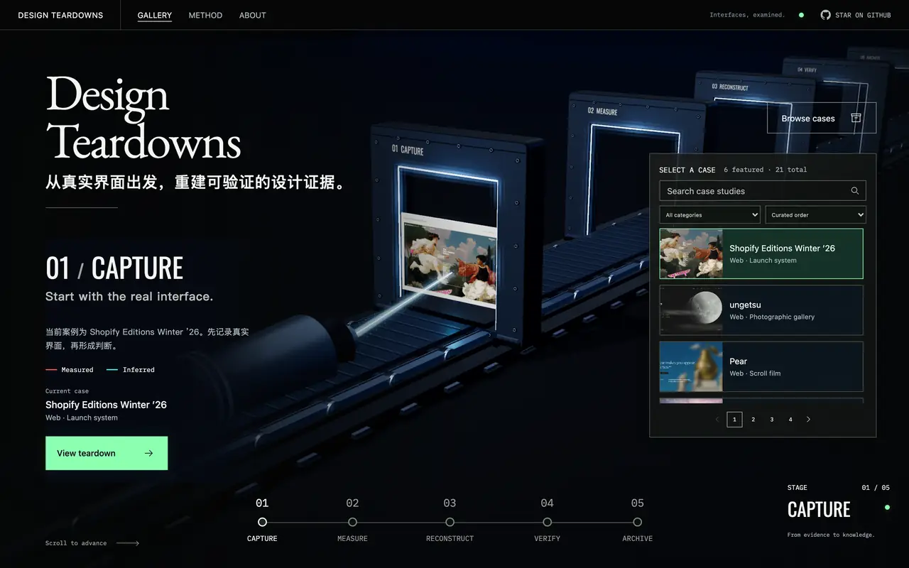
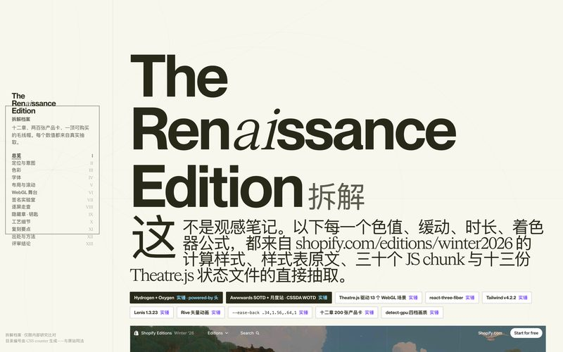
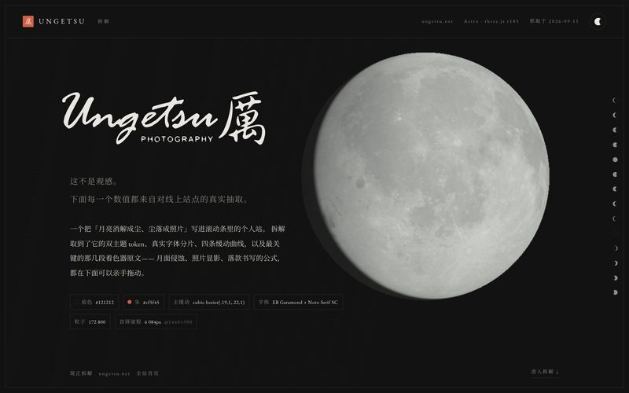
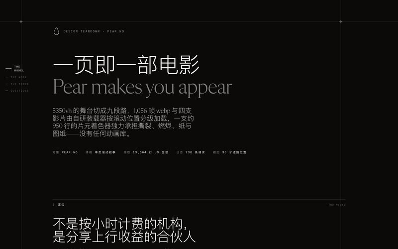
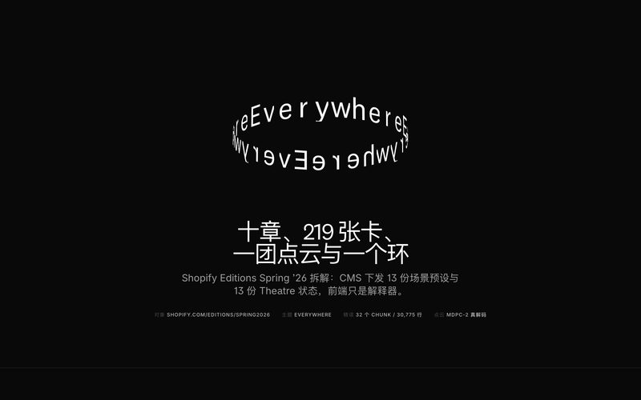
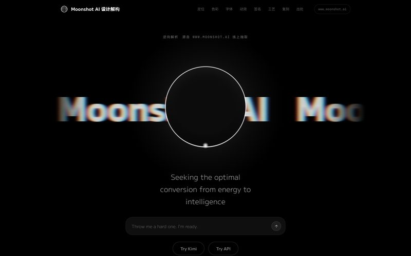
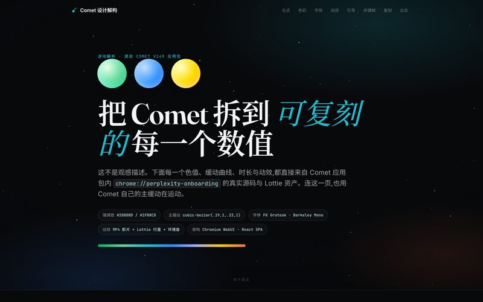

<div align="center">

<a href="https://yunyueli.github.io/design-teardowns/teardowns/index.html">
  <picture>
    <source media="(prefers-reduced-motion: reduce)" srcset="https://raw.githubusercontent.com/YunyueLi/design-teardowns/main/teardowns/_gallery/beamline-readme.jpg">
    
  </picture>
</a>

<sub>真实运行中的画廊：每一帧都是实时 WebGL 场景，停在精确的滚动位置。</sub>

# Design Teardowns

**Interfaces, examined.** 把优秀界面拆成可验证、可复用的设计知识。

[浏览画廊](https://yunyueli.github.io/design-teardowns/teardowns/index.html) · [研究方法](skills/design-teardown/references/method.md) · [自己拆一份](#自己拆一份) · [授权与出处](NOTICE) · [English](README.md)

</div>

## 一个案例，五个工位

<table>
  <tr>
    <td align="center" valign="top" width="20%"><sub>01</sub><br><b>捕获</b><br><sub>先从真实界面开始。</sub></td>
    <td align="center" valign="top" width="20%"><sub>02</sub><br><b>测量</b><br><sub>量系统，不量表皮。</sub></td>
    <td align="center" valign="top" width="20%"><sub>03</sub><br><b>重构</b><br><sub>从证据重建。</sub></td>
    <td align="center" valign="top" width="20%"><sub>04</sub><br><b>验证</b><br><sub>每条结论都可追溯。</sub></td>
    <td align="center" valign="top" width="20%"><sub>05</sub><br><b>归档</b><br><sub>一份活着的设计证据档案。</sub></td>
  </tr>
</table>

每份拆解都从真实页面出发：记录素材与交互状态，测量字体、颜色、布局与动效，用对象自己的设计语言重建关键体验，再把每条结论与出处逐项对照。

 **实测** 表示可直接追溯的直接观察。  **推断** 表示建立在证据上的判断，同时写明依据与边界。

在画廊里，五个工位构成一件实时 Three.js 仪器。滚动或点击工位，传送带、滚轮和预览一同移动，相机跟随前进；滚动停下就停在原地，点击工位才精确停靠。手机、横屏、键盘与减弱动态偏好都有对应路径；三维不可用时，静态入口仍然通向各份研究。场景表达的是过程，结论在每份研究的证据里。

## 当前展览

首页固定展示六份精选，每一份都用研究对象自己的设计语言写成可交互的页面。

<table>
  <tr>
    <td width="33%" valign="top">
      <a href="https://yunyueli.github.io/design-teardowns/teardowns/shopify-editions/teardown.html"><br><b>Shopify Editions Winter ’26</b></a><br>
      <sub>The Renaissance Edition<br>Web · Launch system</sub>
    </td>
    <td width="33%" valign="top">
      <a href="https://yunyueli.github.io/design-teardowns/teardowns/ungetsu/teardown.html"><br><b>ungetsu · 雲月</b></a><br>
      <sub>会消解成尘的月亮<br>Web · Photographic gallery</sub>
    </td>
    <td width="33%" valign="top">
      <a href="https://yunyueli.github.io/design-teardowns/teardowns/pear/teardown.html"><br><b>Pear</b></a><br>
      <sub>Pear makes you appear<br>Web · Scroll film</sub>
    </td>
  </tr>
</table>
<table>
  <tr>
    <td width="33%" valign="top">
      <a href="https://yunyueli.github.io/design-teardowns/teardowns/shopify-editions-spring26/teardown.html"><br><b>Shopify Editions Spring ’26</b></a><br>
      <sub>The Everywhere Edition<br>Web · Launch system</sub>
    </td>
    <td width="33%" valign="top">
      <a href="https://yunyueli.github.io/design-teardowns/teardowns/moonshot/teardown.html"><br><b>Moonshot AI · 月之暗面</b></a><br>
      <sub>月之暗面<br>Web · AI platform</sub>
    </td>
    <td width="33%" valign="top">
      <a href="https://yunyueli.github.io/design-teardowns/teardowns/comet/teardown.html"><br><b>Comet</b></a><br>
      <sub>Perplexity 的原生浏览器<br>Desktop · AI browser</sub>
    </td>
  </tr>
</table>

案例档案库目前有 **21 份设计拆解**，覆盖 reference、agent、product 与 independent 四类。搜索、筛选与分页见[画廊](https://yunyueli.github.io/design-teardowns/teardowns/index.html)，完整目录见 [catalogue.js](teardowns/_gallery/catalogue.js)。研究正文用简体中文撰写；token、CSS 与复现代码不受语言限制。

## 一份研究里有什么

每份研究位于 `teardowns/<slug>/`，具体产物以研究对象为准：

| 文件 | 内容 |
| :--- | :--- |
| `teardown.html` | 可交互的研究页，含可运行的复现示例 |
| `设计解构.md` | 视觉系统、布局与交互分析 |
| `复刻指南.md` | 实现步骤与工程取舍 |
| `出处与方法.md` | 捕获来源、测量方法、推断与局限 |
| `事实核查.md` · `设计评审.md` | 逐项核对与研究复盘 |
| `tokens.json` · `design-tokens.css` | 抽取出的 token，作为结构化证据 |
| `real-assets/manifest.json` | 所采集素材的出处记录 |

## 自己拆一份

采集与研究流程打包为 Claude Code 的 [design-teardown Skill](skills/design-teardown/SKILL.md)。它用 Playwright 从在线页面取真实的 computed style 和文件，而不是靠肉眼估计，并给每个数值标注来源。通过插件市场安装：

```text
/plugin marketplace add YunyueLi/design-teardowns
/plugin install design-teardown@design-teardowns
```

也可以直接使用仓库中的 [design-teardown.skill](design-teardown.skill)。采集工具的浏览器依赖与画廊运行依赖分开管理。

## 本地运行

在仓库根目录运行：

```bash
python3 -m http.server 4174 --bind 127.0.0.1
```

打开 [本地画廊](http://127.0.0.1:4174/teardowns/index.html)。画廊不需要安装 npm 依赖、构建或后端服务；运行时、字体和图像均随仓库提供。请通过 HTTP 预览，避免 `file://` 对图片纹理的限制。

## 维护案例档案库

新增研究请先看[贡献指南](CONTRIBUTING.md)。在 [catalogue.js](teardowns/_gallery/catalogue.js) 中加入经过出处核对的记录、案例页面和封面，然后运行：

```bash
node tools/build-gallery-featured.mjs
node tools/build-gallery-featured.mjs --check
node tools/check-gallery.mjs
```

这两个工具只使用 Node.js 内置模块。生成器同步精选数据与数量；检查器核对数据一致性、案例入口、封面、文档和许可路径。精选六项的元数据从完整目录派生，默认顺序在加载完整目录、筛选后返回及展开弹窗时保持一致。旧的 `tools/generate_index.py` 兼容入口也只更新数据，不再覆盖首页布局。

README 的素材来自运行中的画廊。起好本地服务后，`node tools/readme-media.mjs` 会重新截取上面的循环动图、它的静态图（同时是画廊的社交分享图）以及研究页缩略图。它需要硬件 WebGL、锁定的浏览器依赖（`npm ci --ignore-scripts --prefix tools/browser`）以及带 Pillow 的 Python 3；当 [当前展览](#当前展览) 的网格与精选顺序不一致时会给出提示。

实现说明见 [DESIGN.md](DESIGN.md)，产品行为见 [PRODUCT.md](PRODUCT.md)。

## 验证与交付

浏览器验收覆盖五工位停靠、连续滚动、工位切换、搜索分页、键盘、横竖屏及真实 WebGL 故障恢复；当前本地完整检查 **45/45 通过**（SwiftShader 下执行功能验收，GPU 时延门槛不作认证）。命令、实测数据和验证边界见[验收记录](ACCEPTANCE.md)。发布前由 CI 重跑数据与浏览器检查，通过后部署到 GitHub Pages；线上版本以[发布记录](https://github.com/YunyueLi/design-teardowns/actions/workflows/pages.yml)为准。

## 授权

项目代码采用 [MIT](LICENSE-CODE)，项目有权许可的原创内容采用 [CC BY 4.0](LICENSE)。第三方商标、截图内容、字体、媒体和原站素材保留原权利人的权利；素材的研究用途与使用边界见 [NOTICE](NOTICE) 及各研究的出处文档。

Three.js 与内置字体的许可随仓库保存。本项目独立于所研究产品，无隶属、赞助或背书关系。
